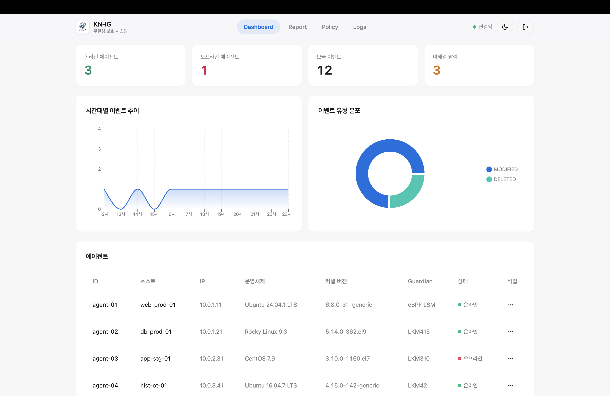
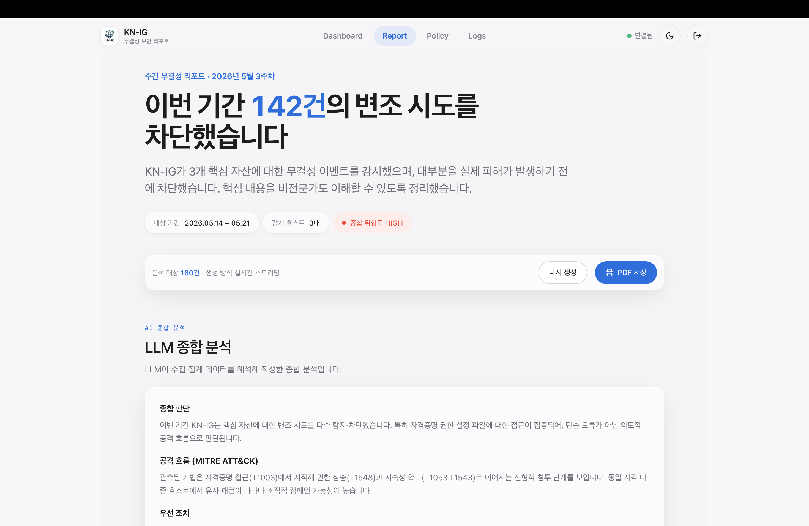
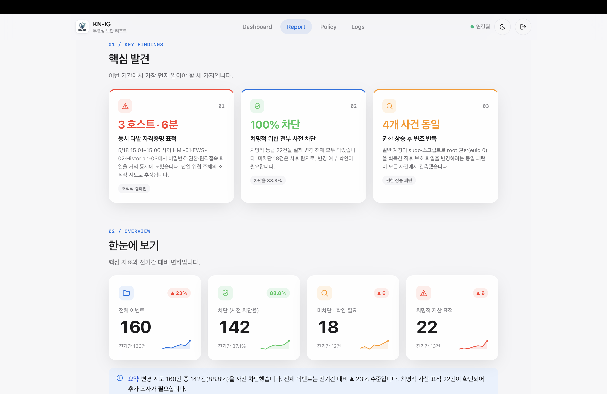
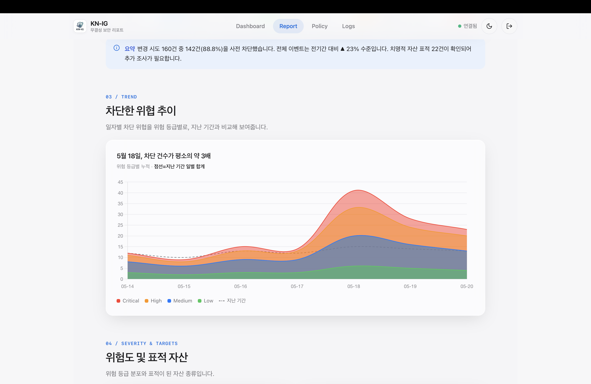
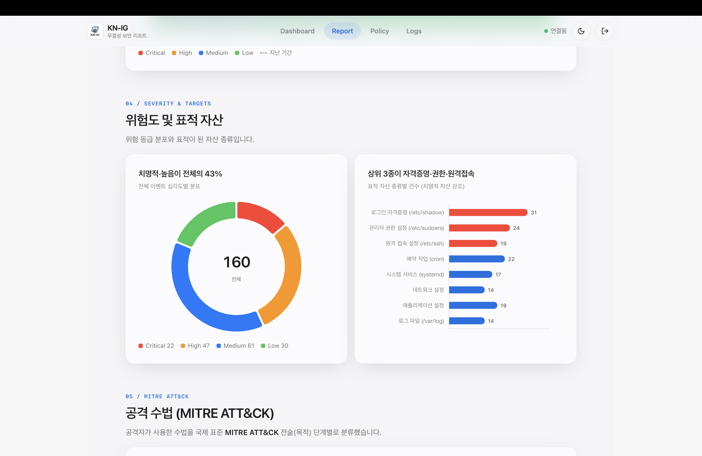
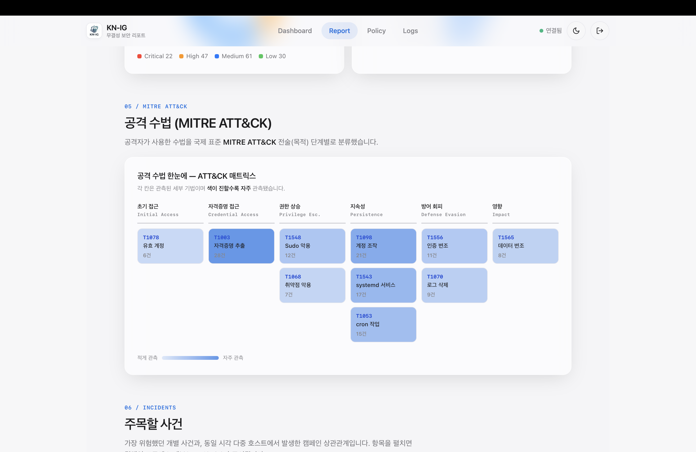
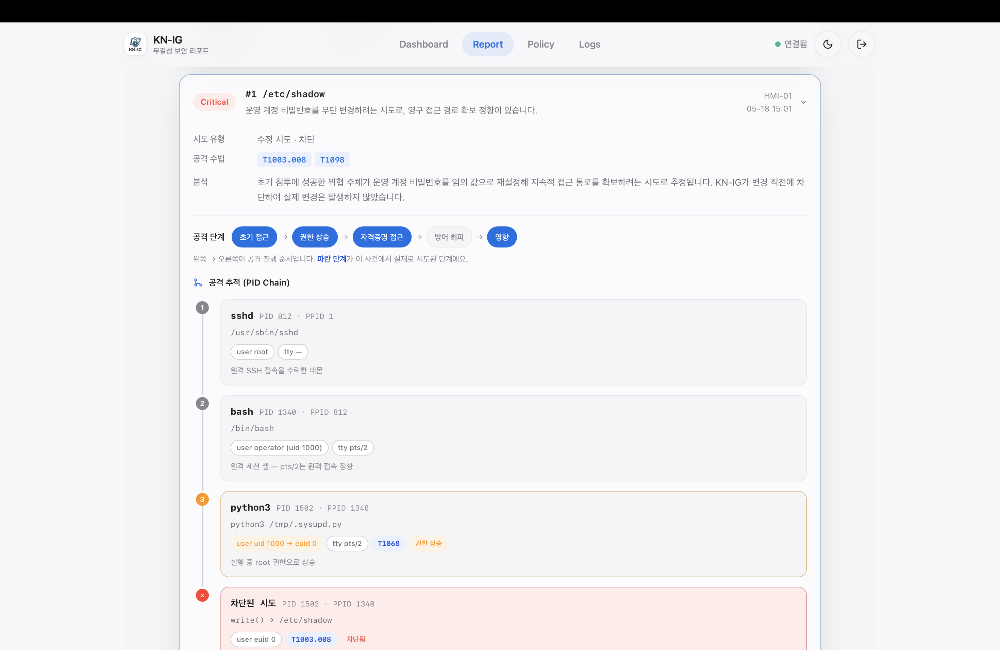

# KN-IG

망분리 OT 환경을 위한 파일 무결성 감시 시스템. 에이전트가 커널(eBPF/LKM)에서 변조를
탐지·차단하고, 중앙 서버가 수집·저장하며, 콘솔이 대시보드·리포트로 보여줍니다.

## 주요 화면

### Dashboard

에이전트 온라인/오프라인 상태, 당일 이벤트, 미해결 알림, 시간대별 이벤트 추이와
이벤트 유형 분포를 한 화면에서 확인합니다.



### LLM 보안 리포트

LLM 리포트는 Backend가 집계한 이벤트·알림·에이전트 데이터를 바탕으로 생성됩니다.
수치와 통계는 코드로 계산하고, 종합 판단과 설명 문장만 LLM이 작성해 운영자가 바로
읽을 수 있는 주간 무결성 리포트 형태로 제공합니다.













## 구성

| 구성 | 역할 | 문서 |
|---|---|---|
| **Agent** (C, Linux) | 커널 후킹으로 무결성 변조 탐지/차단 → 중앙 전송(mTLS) | [Agent/](Agent/README.md) |
| **Backend** (Go) | TCP collector 수집·MySQL 저장·REST/SSE | [Backend/](Backend/README.md) |
| **LLM** (FastAPI) | 기간 종합 리포트 생성(숫자=코드, 서술=LLM) | [LLM/](LLM/README.md) |
| **Console** (Tauri) | 관리자 GUI(대시보드·리포트·로그·정책) | [Frontend/](Frontend/README.md) |

## 배포

각 VM에서 **역할 한 줄** (단일 진입점 `kn-ig`):

```bash
git clone <repo> && cd KN-IG
sudo ./kn-ig --server          # 중앙(Backend+MySQL)  :8080 · :9000
sudo ./kn-ig --llm             # LLM                  :8088
sudo ./kn-ig --agent <중앙IP>   # Agent (인증서 물리 삽입 후)
     ./kn-ig --verify          # 검증 (FAIL=0 이면 완료)
```

배포·검증 상세: [deploy/README.md](deploy/README.md) · [docs/verification.md](docs/verification.md).
문제 해결: [TROUBLESHOOTING.md](TROUBLESHOOTING.md) · 미해결 과제: [TODO.md](TODO.md).

# Members
Kang jiwoon  
Kim juhwan  
Kim Taewoo  
Na Wonhyun  
